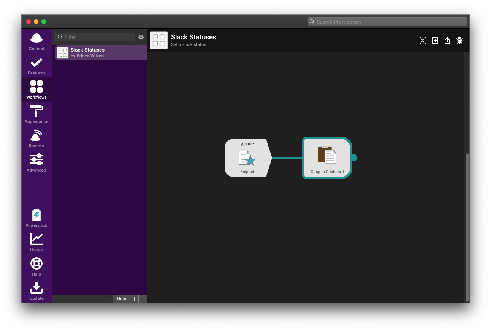
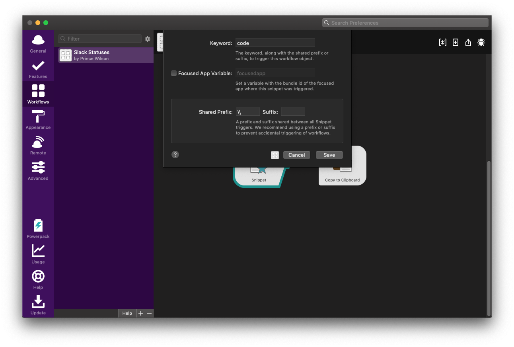
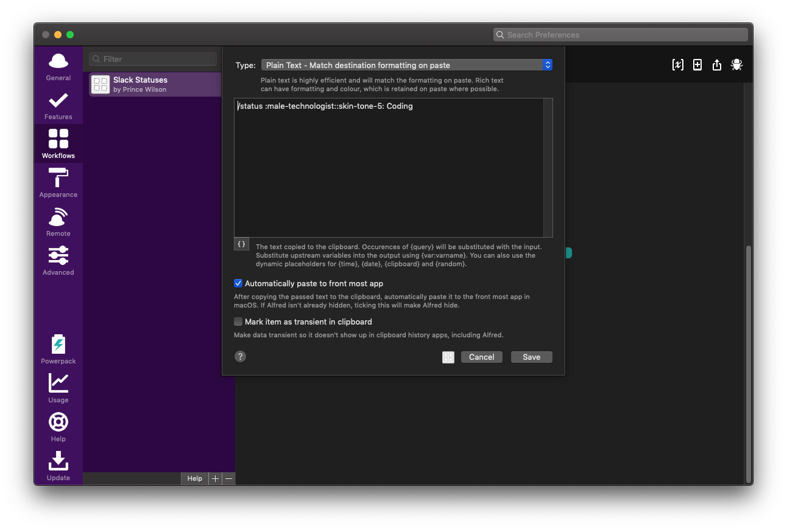

I am a person who really cares about removing as much friction to my own
workflows as much as possible. The smallest of things cause me daily
time wasters and I try to avoid them whenever I can, even if it is small
things.

I wanted to keep a running list of workflows I created to help me minimize
and keep the flow going.

<Callout>

**Note**: Using workflows in Alfred requires $$$ so the things I
am about to show are within the [Powerpack](https://www.alfredapp.com/powerpack/). Make the call yourself if you want it. 
I decided that the [lifetime license](https://www.alfredapp.com/shop/) would be make it worth it in the long term,
if use it.
</Callout>

### Slack Statuses

While working from home, I had been manually changing my Slack status
to accurately communicate what I am doing at the moment. Most of the time
it is me switching between coding/meetings/lunch and unavailable. Because
of the Slack UI, it takes a lot of steps for me to switch.

To make it easier for me, I have some workflows for myself. When I am
starting my day, I open Slack and type in `\\code` which translates to
`/status :male-technologist::skin-tone-5: Coding`. `/status` is the command to set
your status and you can pass in the emoji and the text you want the status to have.

At a high level this means having a workflow that involves a snippet and a copy-to-clipboard output:

In my snippet trigger, I look for the keyword `code` and I like the default check of the `\\` prefix:

Then this leads to a copy to clipboard output sending the `/status :male-technologist::skin-tone-5: Coding`
to my clipboard:

I also turn on the `Automatically paste to the front most app` check. This will automatically
be sent to slack and I just submit it!