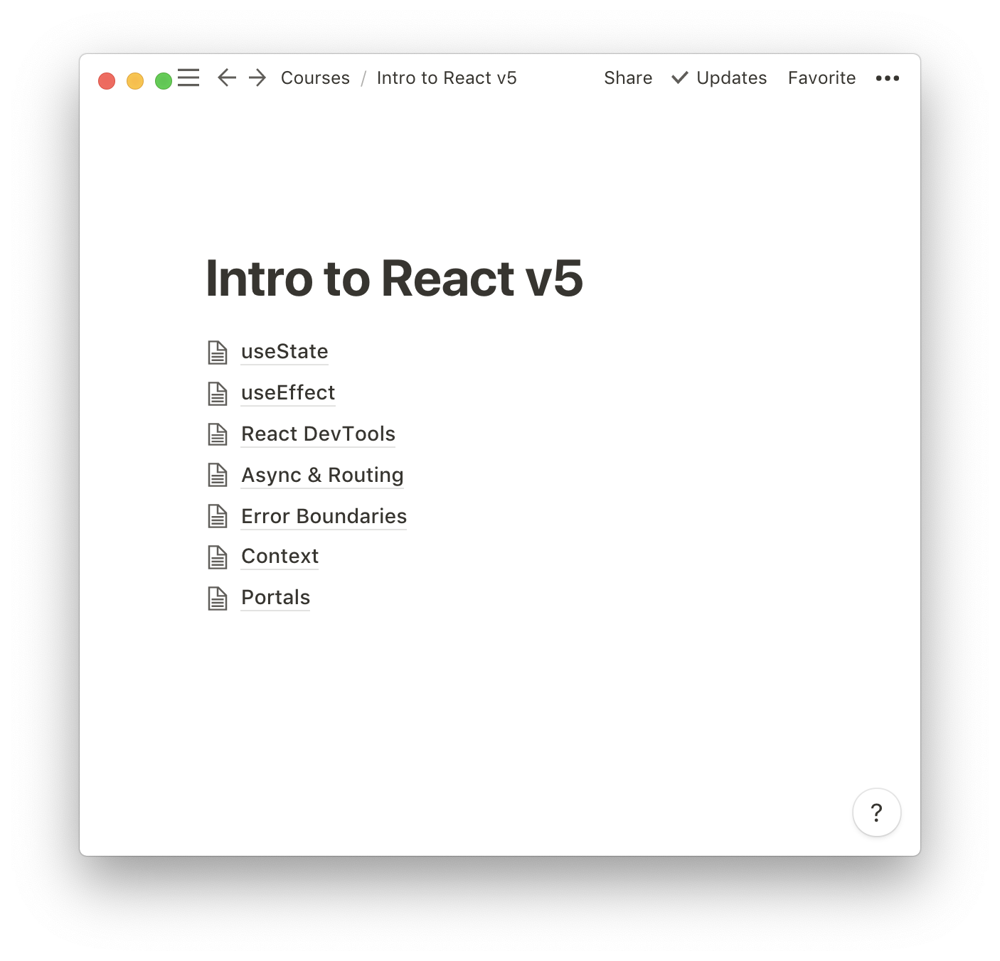

Being a software developer is an incredible thing! There are opportunities to learn new things and almost immediately begin to apply them. Yet, one thing I've noticed is that with so much to learn, it is hard to immediately recall that knowledge if we don't use it often. Many people believe that the best way of learning something is by building and creating -- and I truly believe in that. But there is a caveat to this rule, you should not ONLY be building. More experienced developers say building is how they learn best. That's because they've gotten good at locating working answers to problems they encounter in the process.

If we want to master a skill or technology, we need to build better habits to recalling
information and one way we do that is by taking notes. Many people in school may have felt that they never reviewed their notes or just wrote down scribbles in class. Hell, I did the same thing. A problem is that we've never had to exercise the skill on **good** note-taking. It takes time and energy, but this skill can help us now and in the future.

## Where to begin?

How can we build a better relationship with note-taking? We have to start with
the root of the problem -- ourselves. We need to remember that the purpose of note-taking
is to be able to reflect and review the things we're learning. It isn't just a cheat sheet
for an exam. We want these to be high fidelity so we can reflect on all the tooling/techniques we've encountered. If we treat notes just like scratch paper to jot down what we're hearing, we won't actually be able to go back
and apply anything. It would be hard to remember the context of why you wrote down a phrase.

So with the mindest that it will take time, let's begin with a few helpful strategies for note-taking.

## Having a System

Before electronics were glued to us, we used to have to write everything with a
pen and paper. Now with so many new pieces of technology, we can write notes
practically anywhere. Some apps that I've used in the past for taking notes
is just text files across my computer, [Evernote][evernote], [OneNote][onenote], and
the one that is supposedly developer friendly, [Boostnote][boostnote].
All of these have their advantages/drawbacks; find out what works best for you.
What we want to do is come up with good strategies to ingest and digest the things
we're learning. We need to write notes with the context of the whos, whats,
whys, and hows.

As an example, I will showcase to you how I learned a new piece of technology called,
[React Hooks](react-hooks), and talk about my thought process as I take notes.

### Chunking Notes into Topics

I took this class called, Intro to React by Brian Holt over on Frontend Masters.
As a teacher, I always have to be growing too. For note-taking I use
[Notion][notion]. With my system, I enjoy making an outline of the information.
The goal is to quickly "chunk" information together and make it easier to retrieve
or find.

This makes it easy to identify what topic am I going over in that particular section.
It is not likely I will find any insights in the `Context` section if the code
I am writing only involves something like `useEffect`.

Organizing our notes into chunks may feel obvious. I know for myself I began putting
everything in one HUGE text file but that makes it harder to figure out
what the heck I am looking for or how to even go about finding anything beyond
a `CMD+F`.

### Breaking down a Topic

If we take a gander through one of my pages, you'll see my notes are
somewhat self-contained thoughts. They aren't only just sentences but also
commented out code. Notes should contain anything you think might be helpful
to your future self. You don't need to write every detail but snippets of code
and context of why you wrote that can be insightful. Since our brain can't store
everything we learn forever and easily recall it, this is a nice way to make something easy to reference.

I make sure to indicate to myself what things are important by some sort of emphasis,
such as the order of which I put items into the second parameter of `useEffect` doesn't matter.
I like to use bolds because it is easy for my eyes to immediately identify at a glance.

To make sure I am actively learning, I tend to write down questions I have as I am hearing
explanations or curious about how something works. I indicate them with **???** in front.
I write these questions down before having the answer just to give myself
the opportunity to ingest and digest the information. Ingestion describes how I
take information in versus digestion is how I break down that information.

Being able to pre-test yourself or come up with questions and find the answers
on your own lets your brain build deeper neural connections. These can lead to more
meaningful connections to the thing you're learning about. Resulting in you recalling them even better.

### Takeaways for a System

Have some way of easily identifying what the contents of those notes contain.
Similar to a filing system, we want to be able to easily retrieve it. And if you notice
your system needs to expand, feel free to do so. This is meant to be living and growing.

When writing notes, we want to be sure to encapsulate the meaning behind what we're writing.
We don't want to just quick two-word blurbs all over our page. We need to think of them
as small bubbles of thoughts around the topic. They don't need to be concrete or connected
but they need to be 1) relevant and 2) explainable.

## Visuals Enhance Learning

One thing that I have learned as a teacher is that there are going to be different
ways that help us process information. Not just writing it down in one form will ensure
that one completely understand a topic. I have gotten in the habit of doing is
also freehanding a lot of my notes and feeling okay with marking them up. You can
actually see the notes on my [reMarkable][remarkable], an e-ink tablet
(not a pitch by any means).

Marking up the code and indicating what exactly is happening helps me retain the information
more than just typing it out. The mental act of deconstructing the syntax of code
helps to digest more of the information and recognize patterns in other places.
On the bottom of my notes, I take some bullet notes just so I can identify anything
that might be significant to remember or to look up.

One of the podcasts I have listened to about pedagogy, [The Cult of Pedagogy][cult-of-pedagogy],
taught me about using mind mapping as a tool to visualize our understanding.
I am not good at it yet -- but we get better by practice. The goal is to have a
"central" theme or idea in the center and then connect information
together to build an entire map that will help us explain that idea.

This may work well for you when you're trying to have a bigger picture understanding of a
concept rather than everyday note-taking. I personally like doing it after I have sat
with a topic for quite some time and use it as a test at recalling anything about the "central" theme.

One last visual technique is called sketchnoting. The core concept is to draw sketches
as you take your notes. Your brain can wander and explore how it wants to relate
information together with fun doodles. We saw that I am not that great at visuals but some people like to exercise their creative side.

Here's an example of someone's sketchnote on how to create a more accessible React app:

<figure style="margin: 0 auto;max-width: 400px;vertical-align: middle;display: block;padding-bottom: 20px;">

<figcaption><small><em>Image from <a href="https://twitter.com/stephaniecodes/status/1017121412971225090">@stephaniecodes</a></em></small></figcaption>
</figure>

The thing to remember is that there is no one **right** way to sketchnote. There
are no rules to it. Don't worry if the drawings aren't great. The goal
should be to see how you can take your notes and explore meaning through visual and textual
expression.

## Where to Go From Here

My suggestion for you, friend, is to give note-taking another shot. Maybe
you only do it when you're taking a new course or reading about a framework.
This time, try to break your thoughts down. Think about how you would want to
have shaped the information and how you would share it to someone else.

After you've written your notes, guess what! You've gotten one step closer already to
writing that blog post that you might want, the presentation topic you want to give
to your colleagues, or creating a working knowledge base for your growing team.
Once we change our relationship with note-taking, we end up allowing
ourselves to thrive in it. This leads to compound wins for everyone around you.

Try it out for a week or two and let me know how it goes.

[evernote]: https://evernote.com/
[onenote]: https://products.office.com/en-us/onenote/digital-note-taking-app
[boostnote]: https://boostnote.io/
[notion]: https://notion.so
[remarkable]: https://remarkable.com/
[cult-of-pedagogy]: https://www.cultofpedagogy.com/note-taking/
