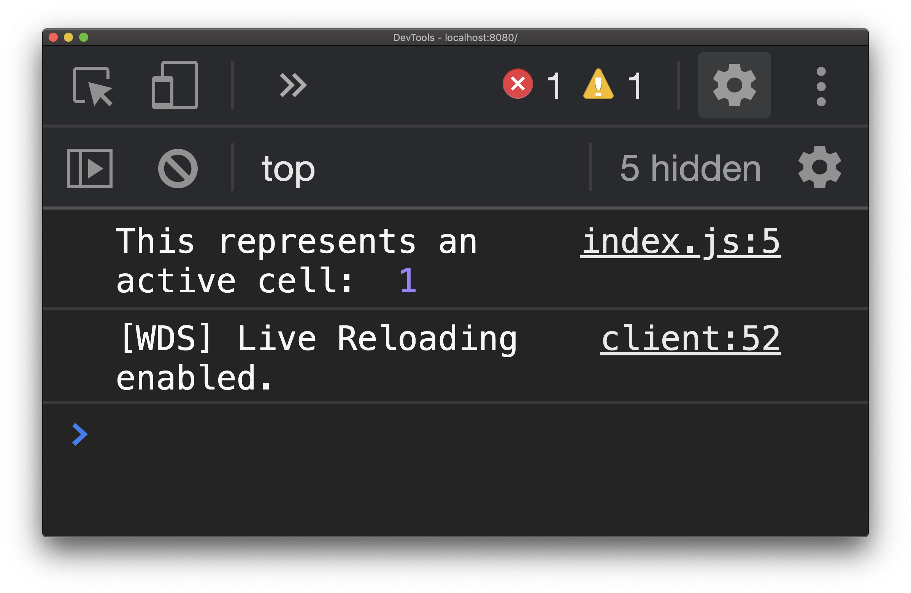
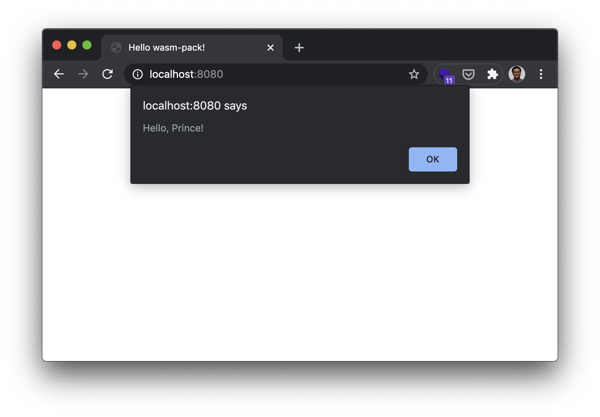

While going through [the Rust + wasm book][rust-wasm-book], I wanted to archive some of the knowledge it gave me. Particularly because this is the first time I wrote any Rust + WebAssembly (Wasm) code, let alone used it in the browser!

The book hops from a "Hello, World" program to a [Conway's Game of Life][conway-gol] program. I'm just going
to talk about the high points since the latter puts a lot of Rust architecture and concepts
together. If you're more interested in
the code, you can find [the finished repository of my walkthrough on GitHub][my-rust-wasm-repo] or
you can see [a demo of the resulting code][rust-wasm-col].

### The What and Why

To start off, you can think of Wasm as this format that tells a computer how to
handle a set of instructions for binary code. A huge motivator
for Wasm is to be portable so it can be used across different environments, such as
the web browser or inside server-side applications.  It tries to make no assumptions around
_where_ it is being called.

Using it with Rust allows us to have the granularity of control of how things should
be communicating together. It also allows us to continue to integrate with our current
JS toolset, meaning we can incrementally port things over to it and have it work together 
with what we already have.

### Connecting Rust and JavaScript with `wasm_bindgen`

One important tool needed is [wasm-pack][wasm-pack-github]. This tool helps us
with writing our Rust code that will need to get converted to Wasm.

Beyond anything we want to use needing to be `pub` from Rust, we also need
the `#[wasm_bindgen]` attribute:

```rust {2}
// src/lib.rs
#[wasm_bindgen]
pub enum Cell {
    Inactive => 0,
    Active => 1
}
```

This is the crux of what allows us to communicate what is exported or imported for
us to use either on the Rust side or the JavaScript side. Inside of the `src/lib.rs`
this `Cell` enum is exported for us to be able to **import** in JavaScript 🤯.

The tutorial also showed in the beginning we can also take functions from the JavaScript
side. For instance, we can take the `alert` function to the Rust side and use it as we 
like. In our Rust code, we have to mark the functions we want to use through an `extern "C"` as well as the `wasm_bindgen` attribute:

```rust {2-5,9}
// src/lib.rs
#[wasm_bindgen]
extern "C" {
  fn alert(s: &str);
}

#[wasm_bindgen]
pub fn greet(name: &str) {
  alert(&format!("Hello, {}!", name));
}
```

We declared that our `alert` function will only take in strings and we can then
also push this new `greet` function to our `src/index.js` through an import.

### Creating the Wasm and JavaScript glue

Before you can use any of the Rust code we've written, you have to make sure to
create the Wasm and JavaScript glue code. Since we have `wasm-pack` we can go to
our folder in the terminal and build it with `wasm-pack build`.

```bash 
$ wasm-pack build
Compiling wasm-game-of-life v0.1.0 (/<...>/wasm-game-of-life)
  Finished release [optimized] target(s) in 0.99s
[INFO]: ⬇️  Installing wasm-bindgen...
[INFO]: Optimizing wasm binaries with `wasm-opt`...
[INFO]: Optional fields missing from Cargo.toml: 'description', 'repository', and 'license'. These are not necessary, but recommended
[INFO]: ✨   Done in 1.39s
[INFO]: 📦   Your wasm pkg is ready to publish at /<...>/wasm-game-of-life/pkg.
```

### Using exported functions from Wasm to JavaScript

Since we're using Webpack, it handles the logic needed to make sure our package
is accessible as a module for us. So let's pull in the `Cell` enum and use our
`greet` function:

```javascript
// This import is connected to a local package through our package.json
import {Cell, greet} from 'wasm-game-of-life';

console.log('This represents an active cell: ', Cell.Active);
greet("Prince");
```

And due to that, we see:





### Conclusion

From here, I am gonna keep doing more research of where Wasm can be used and how.
The promise of being able to have the portability that we want is realy appealing
and exciting. I think it also important to say this isn't truly meant to replace
JavaScript as it stands, but it does afford us the ability to really investigate
how to offload the performance we want.

[conway-gol]: https://en.wikipedia.org/wiki/Conway%27s_Game_of_Life
[rust-wasm-book]: https://rustwasm.github.io/docs/book
[my-rust-wasm-repo]: https://github.com/maxcell/rust-wasm-game-of-life
[rust-wasm-col]: https://rust-wasm-gol.netlify.app/
[wasm-pack-github]: https://github.com/rustwasm/wasm-pack